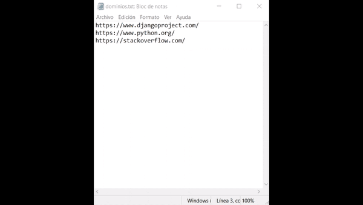
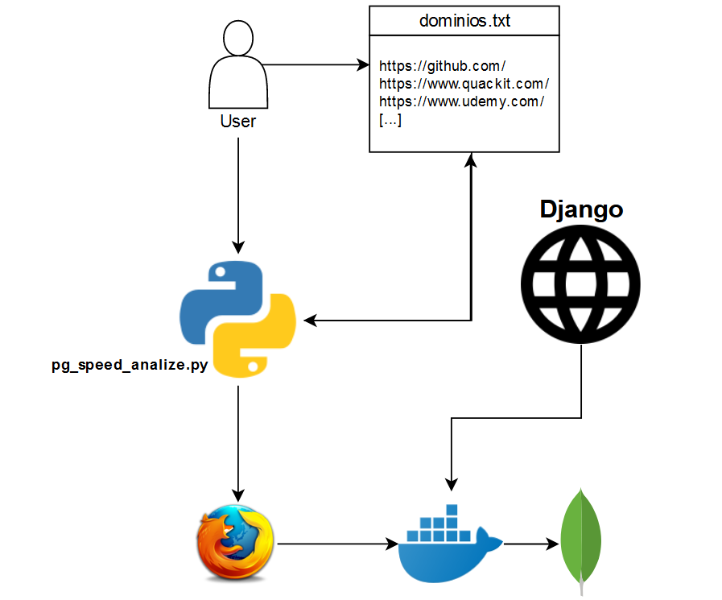

# PageSpeed-Insights---Selenium-Python

En este proyecto vamos a realizar una herramienta en python v.3.6, la cual realizará automaticamente el analisis de diferentes URLs en page speed insight.   
      

## Funcionamiento 
El funcionamiento de la herramienta es muy simple, un usuario escribe en un archivo txt las URLs que desea analizar con page speed insight. Ahora el usuario tendrá que ejecutar el el python pg_speed_analize.py, el cual gracias a selenium y a un web driver irá recorriendo las diferentes URLs dentro de la web y extrayendo la información más relevante, a su vez la irá introduciendo en una base de datos MongoDB.   

   

## Instalacion 
Necesitaremos la version de python 3.7.3    
- Este es el *[link de descarga.](https://www.python.org/downloads/)*
Dentro de python tendremos que tener instaladas las siguientes librerias.
- Libreria de Selenium     
  ``pip install selenium``
- Libreria de MongoDB    
  ``pip install pymongo``
- Libreria de Psutil
